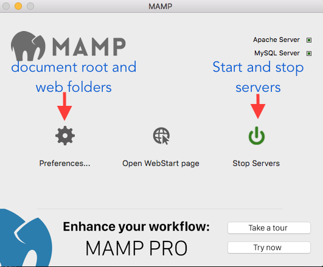
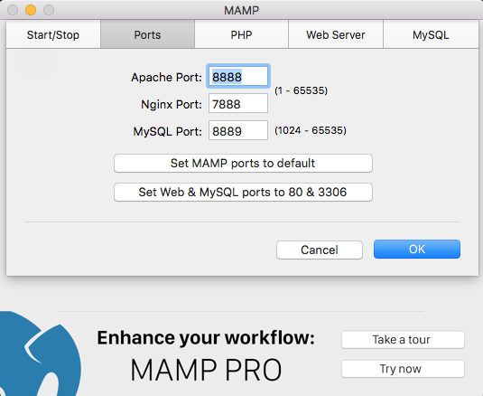
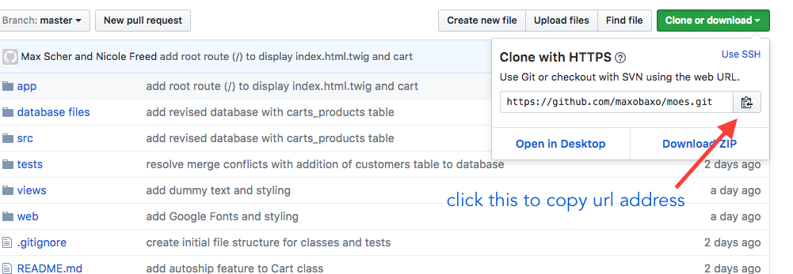
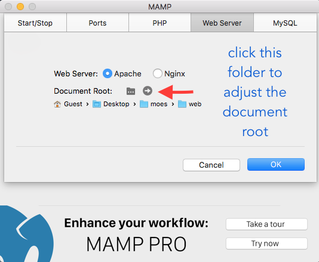

# _PHP installation instructions_

#### _July 28, 2017_

#### By **Michelle Poterek**

## Description

_This is meant to give basic setup instructions for programmers writing PHP using Apache, MAMP, and mySQL._

## Specifications

1. Allows user to focus on creating a program that's more easily accessible to the general public who may not be terribly familiar with setting up a localhost.
2. User is able to clone repository and have basic skelleton of a README.
3. These numbers are really just here so you can have a basic template for your own project specifications.

## Setup/Installation Requirements

Download and Install MAMP:
* Download the free version of MAMP from the [MAMP Downloads Page](https://www.mamp.info/en/downloads). Both Mac OS X and Windows are available. (You'll need to have version 4.1.0 or higher for Mac and 3.3.0 or higher for Windows).
* Once downloaded, open the file:
    * For Mac: This is a.pkg file.
    * For Windows: This is an .exe file.
* At this point, Mac installation is actually complete.
* Windows users will be prompted with an installation wizard. The default values and settings suggested at each step are just fine (You may specify a different location for your MAMP installation, if you prefer, just remember exactly where it is; we'll need to locate our MAMP installation in the next step).

### Configure Port Numbers:  
_You must configure Apache and MySQL to use the correct port numbers in MAMP._

* Launch your newly-installed MAMP program.
* A popup may appear upon first launch. If so, uncheck the option reading Check for MAMP Pro when starting MAMP (You may upgrade to MAMP Pro later, but the free version meets all requirements for our course) then click Launch MAMP.
* When MAMP launches you will be greeted by a small window with several options. Click Preferences.

* In the Preferences window, select the Ports tab.
* Set the Apache Port to 8888.
* Set the MySQL Port to 8889.
* Click OK to save your new port configurations.

  

### Access Project Repository & Open Project
* Open GitHub site on your browser: https://github.com/PoterekM/php-readme.git
* Select the green dropdown menu to clone this repository.
* Copy the link for the GitHub repository.

* Open Terminal on your computer.
* In Terminal, perform the following steps:
    * type 'cd desktop' and press enter
    * type 'git clone' then paste the repository link, and press enter
    * type 'cd php-readme' to access the path on your computer
    * type 'composer install' in terminal to download dependencies
* In MAMP, perform the following steps:
    * Select the Start Servers option.
    * Go to preferences>web server and click on the folder icon next to 'document root'.
    * Click on 'web' folder of project and hit 'select'.

 

    * Hit ok at the bottom of the preferences window.

### Retrieve the databases
###### Download Databases (Preferred Way)
* Open a new window in your browser, enter the URL: localhost:8888/phpMyAdmin
    * Choose the Import tab and select the `shoes.sql.zip` file and click Go.
    * It's important to make sure you're not importing to a database that already exists, so make sure that a database with the name shoes doesn't already exist locally.
    * If the tests are of interest to you, upload `shoe_store_test.squl.zip` as well.
    * when running the tests use the command `$ ./vendor/bin/phpunit` tests
* In your browser, enter the url 'localhost:8888' to view the webpage.

###### Create databases Through Terminal
**It may be easiest to update this section as you are creating the database**
* in Terminal type: `/Applications/MAMP/Library/bin/mysql --host=localhost -uroot -proot`
* `CREATE DATABASE shoe_store;`
* `USE shoe_store;`
* `CREATE TABLE shoes (id serial PRIMARY KEY, brand VARCHAR(30), price INT);`
* `CREATE TABLE stores (id serial PRIMARY KEY, store VARCHAR(30));`
* `CREATE TABLE shoes_stores (id serial PRIMARY KEY, shoe_id INT, store_id INT);`
* In your browser, enter the url 'localhost:8888' to view the webpage.

## Technologies Used

* PHP
* Composer
* Twig
* Silex
* CSS
* Bootstrap
* SQL
* Apache
* MAMP

### Acknowledgements
_Thanks to Epicodus for providing some of the MAMP installation instructions at learnhowtoprogram.com_  

## Support and contact details
_Please feel free to contact me directly via e-mail at poterekm@gmail.com if you have any questions, comments, ideas, or feedback. Also, I invite you to feel empowered to make any changes to this repository by forking it and making changes accordingly. Unfortunately, I had a difficult time downloading MAMP on my computer so the best I can say to you is what you always hear when a developer doesn't know something: "I'm sure you'll figure it out!"_

## Known Bugs
* This program has yet to be tested on non-programmers to determine if it is user friendly for a variety of users with varied computer experience and knowledge.

### License

*This project is under the MIT License*

Copyright (c) 2017 **Michelle Poterek**
